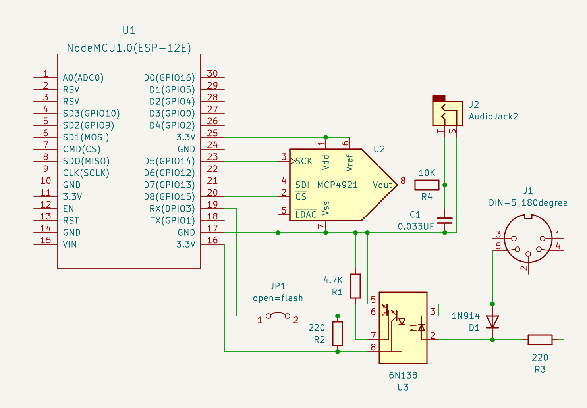

# Electuno. Vintage organ simulator

This project tries to simulate the vintage organs as Electone or Hammond, in small AVRs.

The code still needs a lot of work and organization; But it can be used on esp8266 boards with all the effects activated, two independent keyboards, and a polyphony of 16 simultaneous keys, at a frequency of approximately 22050Hz.

On a simple but effective ATMEL328 you can run two independent keyboards with vibrato/chorus, but the Leslie effect is very heavy.
Later I will try an Arduino DUE and an ESP32.

Specifications:
- Sound output through DAC MCP4921 (It is possible to operate it through PWM or other DACs).
- Controllable via MIDI (You need the MIDI library from the Arduino repositories).
- Fully modular to be able to disable functions on low-power CPUs.
- Simulates two independent keyboards (upper & lower) with nine drawbars each.
- Percussion effect on the upper keyboard.
- Independent vibrato chorus scanner effect for each keyboard.
- Delay effect to simulate a reverb.
- Overdrive effect.
- Two-way Leslie speaker with different speeds and accelerations.

It still has a lot of glitches and dirty noises, but it can be fun. 

**I have made it work on arduino Nano, Mega and Due; Although at the moment, i only have uploaded example files for nodeMCU-esp8266 with MCP4921 DAC and Arduino NANO328 with same DAC.**

**Only tested with Arduino IDE 1.8.19**

I hope little by little to add more example files and configurations (pwm in nano for example)

**Default MIDI configuration**

- Upper keyboard listen on channel 1
- Lower keyboard listen on channel 2
- All controllers on channel 1

- 68 = Percusion key ON/OFF
- 69 = Percusion harmonic
- 71 = Lower vibrato/chorus ON/OFF
- 72 = Upper vibrato/chorus ON/OFF
- 73 = Leslie OFF/SLOW/FAST
- 76 = Reverb
- 77 = Overdrive
- 79 = Upper drawbar 1
- 80 = Upper drawbar 2
- 81 = Upper drawbar 3
- 82 = Upper drawbar 4
- 83 = Upper drawbar 5
- 84 = Upper drawbar 6
- 85 = Upper drawbar 7
- 86 = Upper drawbar 8
- 87 = Upper drawbar 9
- 88 = Lower drawbar 1
- 89 = Lower drawbar 2
- 90 = Lower drawbar 3
- 91 = Lower drawbar 4
- 92 = Lower drawbar 5
- 93 = Lower drawbar 6
- 94 = Lower drawbar 7
- 95 = Lower drawbar 8
- 96 = Lower drawbar 9

Arduino Nano Scheme

NodeMCU esp8266 Scheme

